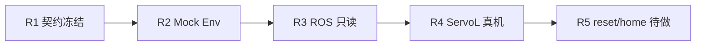

# WA2Env 使用指南（R1～R4）

> 日期：2026-08-11  
> 适用范围：HIL-SERL × NaviAI WA2（Jetson Orin / 容器 `hilserl` / conda `hil-actor`）  
> 契约版本：`0.1.0`  
> 状态：**R1～R4 已验收 PASS**；下一阶段为 R5（reset/home）

本文汇总 Env 配置过程、R1～R4 执行流程、最终 Env 语义与文件索引，供日常使用与复习。更细的契约原文见 [`WA2Env接口契约.md`](./WA2Env接口契约.md)；总体路线图见仓库根目录 [`hil-serl部署.md`](../hil-serl部署.md)。

---

## 1. 一句话结论

**`WA2Env` 是当前唯一合法的左臂连续控制出口**：策略 / 脚本给出归一化 6D action → Env 限幅积分 →（真机时）仅通过 `WA2ServoSession` 发 ServoL。R1 冻结接口，R2 Mock，R3 只读接 ROS，R4 小幅真机运动。

三种运行模式（同一套 `observation_space` / `action_space`）：

| 模式 | 构造参数 | 状态来源 | 是否运动 | 典型用途 |
|---|---|---|---|---|
| Mock | `fake_env=True` | `MockRobot` | 否（仅模拟积分） | Learner / 单测 / 离线 |
| ROS 只读 | `fake_env=False, read_only=True` | `WA2StateMonitor` | **否**（action 被忽略） | 接真机状态、不发控 |
| ServoL 真机 | `fake_env=False, read_only=False` | Monitor + Session | **是**（需 `R4_CONFIRM=YES`） | Gate / 可见运动 demo |

---

## 2. Env 配置过程（从契约到可跑）

### 2.1 配置分层

```text
人可读契约     docs/WA2Env接口契约.md
机器可读契约   configs/experiments/wa2_env_contract.yaml   ← 仓库权威副本
包内副本       catkin_ws/src/hilserl_wa2/configs/wa2_env_contract.yaml
加载器         hilserl_wa2/envs/contracts.py  → WA2EnvContract
运行时 Env     hilserl_wa2/envs/wa2_env.py    → WA2Env
```

修改契约时：**先改仓库根 `configs/experiments/wa2_env_contract.yaml`，再同步包内副本**，并升 `version`。R2 验收用 SHA256 校验两份一致。

### 2.2 已冻结的关键配置项

| 类别 | 冻结值 |
|---|---|
| 臂 | **left** |
| action | 6D `[dx,dy,dz,droll,dpitch,dyaw]`，`float32`，`[-1,1]` |
| 单步上限 | 平移 **1 mm**；旋转 **0.25°** |
| 坐标系 | 平移 **base**；旋转增量 **tool**（右乘） |
| 控制周期 | **50 Hz** / `dt=0.02 s` |
| ServoL | `servo_time=0.02`，`servo_gain=800` |
| 图像 obs | `head` + `wrist`，均为 `uint8[128,128,3]` |
| 头相机 | topic 已启用；R4 阶段图像仍可用 Mock |
| 腕相机 | `enabled: false`，`missing_policy=zero_image`（不得因此 truncate） |
| episode | `max_steps=400`；`reward=0`；`terminated` 占位恒 False |
| 新鲜度 | 状态 / 头图 max age **0.2 s** |
| reset | 契约写明 `manual_pose_tolerance`（**R5 前尚未完整实现自动校验**） |

### 2.3 构造参数（代码侧）

```python
from hilserl_wa2.envs.wa2_env import WA2Env

env = WA2Env(
    fake_env=True,              # True=Mock；False=接 ROS
    read_only=True,             # False 才启用 ServoL（需 fake_env=False）
    dry_run=False,              # True：算目标但不 publish ServoL
    contract_path=None,         # 默认包内 YAML；可指向其它契约
    seed=None,
    state_monitor=None,         # 可注入，便于单测
    servo_session=None,         # 可注入，便于单测
    episode_trans_limit_m=0.03, # 相对 reset 原点的累计平移盒
    episode_rot_limit_deg=5.0,  # 相对 reset 原点的累计姿态盒
)
```

真机运动额外环境变量：

```bash
export R4_CONFIRM=YES   # 缺省拒绝真实 ServoL
```

### 2.4 容器运行前置（所有真机/只读脚本通用）

```bash
docker exec -it hilserl bash
source /opt/conda/etc/profile.d/conda.sh && conda activate hil-actor
source /ros_noetic/catkin_ws/devel/setup.bash
source /opt/ros/noetic/setup.bash --extend
source /root/catkin_ws/devel/setup.bash
export PYTHONPATH=/root/catkin_ws/src:$PYTHONPATH
cd /root/catkin_ws
```

仅 Mock / 单测时可省略 ROS `source`（但统一环境更不易踩坑）。

---

## 3. R1～R4 执行流程总结



### 3.1 R1 — ROS 接口盘点与契约冻结

| 项 | 内容 |
|---|---|
| 目标 | 不发动作；冻结 obs/action/reset/close/安全出口 |
| 方法 | 盘点 topic、采 hz/样本、定相机与限幅 |
| Gate | `python3 docker/verify_r1_contract.py` |
| 产出 | 契约 MD/YAML、接口盘点、`r1_samples/`、验收记录 |
| 判定 | **PASS** → 可进 R2 |

要点：手腕相机 topic 存在但无 Publisher → 契约 `enabled: false`；左臂奇异仅为当时姿态，不改变字段定义，真机 step 前仍须 `is_singular=False`。

### 3.2 R2 — Mock WA2Env

| 项 | 内容 |
|---|---|
| 目标 | 无 ROS 的 Gymnasium Env，spaces 与契约一致 |
| 方法 | `contracts` + `MockRobot` + `MockCameras` + `WA2Env(fake_env=True)` |
| Gate | 单测 + `verify_r2_mock_env.py`（check_env / 随机步 / seed / wrist 零图） |
| 判定 | **PASS** → 可进 R3 |

要点：不 import rospy；图像双键固定；动作按契约积分到 Mock TCP。

### 3.3 R3 — ROS 状态只读

| 项 | 内容 |
|---|---|
| 目标 | 真机状态进 obs；**禁止 ServoL** |
| 方法 | `WA2StateMonitor` + `WA2Env(fake_env=False, read_only=True)` |
| Gate | `verify_r3_readonly_env.py`；可选 `r3_soak_readonly.py`（10 min） |
| 判定 | **PASS** → 可进 R4 |

要点：`step(action)` 仍校验 action，但 `action_ignored_for_motion=True`；stale → `truncated`；全程机器人应静止。

### 3.4 R4 — 安全 ServoL 执行器

| 项 | 内容 |
|---|---|
| 目标 | Env 成为唯一动作出口；小幅、可回退运动 |
| 方法 | `WA2ServoSession` + `WA2Env(..., read_only=False)` |
| Gate | 离线单测 → dry-run → `R4_CONFIRM=YES` 分层 Gate（hold / ±1mm / ±2° / clip / stop+clear） |
| 判定 | **PASS**（物理急停由现场按键负责，未做软件测） |

要点：

1. 未设 `R4_CONFIRM=YES` → 拒绝真运动。  
2. 单步仍 ≤1 mm / 0.25°；肉眼几乎看不见，需多步累计或跑可见 demo。  
3. stale / singular / episode 盒越界 → `stop` + `clear`，`truncated`。  
4. `close()` / 异常 / atexit：软件路径 `stop` → `clear_servo_params`。  
5. **禁止**与 SpaceMouse 直连 ServoL 脚本并行。

### 3.5 阶段边界（复习用）

| 已完成 | 未完成（后续） |
|---|---|
| 契约、Mock、只读、ServoL 小幅 | R5 自动/半自动 reset·home |
| 软件 stop/clear | 真机相机 pipeline（R6） |
| 物理急停（人工） | Intervention 接入 Env（R7） |
| 图像键位冻结 | Actor–Learner 实接（R8+） |

---

## 4. 最终 Env 知识详解（重点）

### 4.1 包结构与数据流

```text
catkin_ws/src/hilserl_wa2/
  envs/
    contracts.py      # YAML → spaces / 常量
    wa2_env.py        # ★ 核心 Gymnasium Env
  ros_adapters/
    mock_robot.py     # R2 状态积分
    mock_cameras.py   # 图像（当前真机路径仍多用 Mock）
    state_monitor.py  # ★ R3 状态订阅缓存
    servo_session.py  # ★ R4 唯一 ServoL 发布
  configs/wa2_env_contract.yaml
  scripts/            # 验收与 demo
  tests/unit/         # 单测
```

真机 step 数据流：

```text
action[-1,1]^6
    → clip
    → integrate_normalized_action (base 平移 + tool 旋转)
    → episode 盒检查（相对 reset 原点）
    → ArmController.servol(left)
    → 下一拍 obs = StateMonitor 最新状态 + MockCameras 图像
```

控制话题（契约）：

| 用途 | Topic / API |
|---|---|
| 设参 | `/zj_humanoid/upperlimb/set_servo_params` |
| 连续位姿 | `/zj_humanoid/upperlimb/servol/left_arm` |
| 停止 | `/zj_humanoid/upperlimb/stop` |
| 清参 | `/zj_humanoid/upperlimb/clear_servo_params` |

### 4.2 Action 语义

```text
action = [dx, dy, dz, droll, dpitch, dyaw] ∈ [-1, 1]^6
```

物理映射（每步，Env / Session 内二次裁剪）：

```text
Δxyz_m   = action[:3] * 0.001      # 最大 1 mm
Δrpy_rad = action[3:] * deg2rad(0.25)
```

另对向量范数再裁一次，保证合位移 / 合转角不超过单步上限。

| 通道 | 积分方式 |
|---|---|
| 平移 | `tcp_xyz ← tcp_xyz + Δxyz`（**base**） |
| 旋转 | `R ← R_current * R_delta`（**tool** 右乘） |
| 姿态表示 | quat **xyzw** |

非法 action（错误 shape / NaN / Inf）→ `ValueError`，不发动作。

### 4.3 Observation 结构

```text
observation = {
  "state": {
    "tcp_pose":    float32[7],   # xyz + quat_xyzw
    "tcp_vel":     float32[6],   # 线速度 + 角速度
    "joint_pos":   float32[8],   # 左臂 8 关节
    "hand_joints": float32[6],   # 左手 6 维
  },
  "images": {
    "head":  uint8[128,128,3],
    "wrist": uint8[128,128,3],   # 未启用时为零图
  },
}
```

状态 topic（R3+）：

| 键 | Topic |
|---|---|
| `tcp_pose` | `/zj_humanoid/upperlimb/tcp_pose/left_arm` |
| `tcp_vel` | `/zj_humanoid/upperlimb/tcp_speed/dual_arm`（字段 `left_arm`） |
| `joint_pos` | `/zj_humanoid/upperlimb/joint_states` |
| `hand_joints` | `/zj_humanoid/hand/joint_states` |
| 奇异等诊断 | `/zj_humanoid/upperlimb/uplimb_state` → `info` |

左臂关节名顺序：

```text
Chest_Z_L, Shoulder_Y_L, Shoulder_X_L, Shoulder_Z_L,
Elbow_L, Wrist_Z_L, Wrist_Y_L, Wrist_X_L
```

### 4.4 `info` 常用字段

| 字段 | 含义 |
|---|---|
| `is_singular` | 左臂是否奇异 |
| `state_age` / `image_age` | 新鲜度 |
| `cmd_num` / `cmd_name` / `iddp_status` | 上层控制状态 |
| `stale` / `stale_fields` | 是否超时及哪些字段 |
| `fake_env` / `read_only` / `dry_run` | 当前模式 |
| `delta_pos_m` / `delta_rot_rad` | 本步命令增量模长 |
| `delta_pos_xyz` / `delta_rot_rpy` | 本步向量增量 |
| `published` | 是否真实 publish ServoL |
| `cmd_tcp` / `meas_tcp` | 命令位姿 vs 测量位姿 |
| `tracking_err_m` / `tracking_err_rad` | 跟踪误差（测量有滞后属正常） |
| `servo_faulted` / `servo_health` | 会话故障与健康快照 |
| `action_ignored_for_motion` | 只读模式标记 |
| `step_count` | 当前 episode 步数 |

### 4.5 `reset` / `step` / `close` 行为

```text
obs, info = env.reset(options={...})
obs, reward, terminated, truncated, info = env.step(action)
env.close()   # stop + clear + 停 monitor；可重复调用语义安全
```

| API | 行为摘要 |
|---|---|
| `reset` | Mock：重置内部状态；ROS：`wait_ready`；真机：新建/重启 `WA2ServoSession.start()`（含 set_servo_params、奇异检查） |
| `step` | 校验 → 模式分支（Mock / 忽略 / ServoL）→ 组 obs；`reward=0`；`max_steps` 等触发 `truncated` |
| `close` | Session `stop`+`clear`；Monitor `stop` |

`reset(options=...)` 常用键：

| key | 用途 |
|---|---|
| `ready_timeout_s` | 等状态就绪超时（默认 5，demo 常用 8） |
| `tcp_pose` / `joint_pos` / `hand_joints` | **仅 Mock** 指定初值 |
| `force_terminated` / `force_truncated` | 测试注入 |

安全与截断：

| 条件 | 结果 |
|---|---|
| `max_steps=400` | `truncated=True` |
| 状态 stale（>0.2s） | `truncated`；真机路径另 fault stop |
| `is_singular` | 不发新动作；真机 fault |
| episode 累计位移/转角超盒 | Session 抛错 → Env truncated |
| 头图 stale | 契约要求 truncate（相机真接后；当前图像多为 Mock） |
| 腕图缺失且 `enabled=false` | **不得** truncate |

### 4.6 安全分层（务必记住）

1. **物理急停**：现场按键，优先级最高。  
2. **确认开关**：`R4_CONFIRM=YES` 才允许真实 ServoL。  
3. **契约单步限幅**：1 mm / 0.25°。  
4. **episode 盒**：相对 session 原点默认 3 cm / 5°（构造参数可调，Gate/demo 可放宽）。  
5. **stale / singular**：stop + clear，拒绝继续。  
6. **唯一发布者**：仅 `WA2ServoSession`；禁止并行遥操直连。  
7. **退出路径**：`close` / 异常 / atexit → stop → clear。

### 4.7 与 SpaceMouse / 上游的关系

- 已有 `interventions/`（SpaceMouse、PoseIntegrator）用于早期遥操验证。  
- **正式训练链路**：SpaceMouse 应映射为 Env 的 action / `intervene_action`，**不得**绕过 Env 直接 ServoL。  
- R7 才会把 Intervention 正式接到本 Env；当前 R4 以脚本驱动 Env 验收为准。

### 4.8 当前已知局限（复习避坑）

- 真机路径 **图像仍 Mock**（头/腕真实 resize 属 R6）。  
- **reset 容差校验未完全落地**（契约已写 `manual_pose_tolerance`，R5 实现）。  
- Gate 默认 ±1 mm 肉眼难见；看运动用 `r4_visible_move_demo.py`。  
- `tracking_err` 首拍常因测量滞后偏大，属预期。  
- 7D 手部 action：**未启用**。

---

## 5. Env 使用指南（实操）

### 5.1 Mock（离线）

```python
import numpy as np
from hilserl_wa2.envs.wa2_env import WA2Env

env = WA2Env(fake_env=True)
obs, info = env.reset(seed=0)
action = np.array([1, 0, 0, 0, 0, 0], dtype=np.float32)  # +X 1mm
obs, r, term, trunc, info = env.step(action)
assert info["delta_pos_m"] <= 0.001 + 1e-9
env.close()
```

一键 Gate：

```bash
python src/hilserl_wa2/scripts/verify_r2_mock_env.py
```

### 5.2 ROS 只读（真机状态、不运动）

```python
env = WA2Env(fake_env=False, read_only=True)
obs, info = env.reset(options={"ready_timeout_s": 8.0})
obs, r, term, trunc, info = env.step(np.zeros(6, np.float32))
assert info.get("action_ignored_for_motion") is True
env.close()
```

```bash
python src/hilserl_wa2/scripts/verify_r3_readonly_env.py
# 可选浸泡
python src/hilserl_wa2/scripts/r3_soak_readonly.py
```

### 5.3 Dry-run（连 ROS，不算真运动）

```bash
python src/hilserl_wa2/scripts/verify_r4_servo_dryrun.py
```

或代码：`WA2Env(fake_env=False, read_only=False, dry_run=True)`。

### 5.4 真机 ServoL（小幅 / 可见）

前置：急停可达、无并行遥操、左臂 `is_singular=False`。

```bash
export R4_CONFIRM=YES

# 验收分层 Gate（单步约 1mm，几乎看不见）
python src/hilserl_wa2/scripts/verify_r4_servo_gates.py --gate all
python src/hilserl_wa2/scripts/r4_hold_zero_action.py --seconds 5

# 可见运动：默认 +X 20mm → 停 1s → 退回（约 20 个满幅步）
python src/hilserl_wa2/scripts/r4_visible_move_demo.py --axis x --steps 20 --dt 0.05
```

最小代码骨架：

```python
import os, time
import numpy as np
from hilserl_wa2.envs.wa2_env import WA2Env

assert os.environ.get("R4_CONFIRM") == "YES"
env = WA2Env(fake_env=False, read_only=False, dry_run=False,
             episode_trans_limit_m=0.05, episode_rot_limit_deg=10.0)
obs, info = env.reset(options={"ready_timeout_s": 8.0})
if info.get("is_singular"):
    env.close(); raise SystemExit("singular")

action = np.array([1, 0, 0, 0, 0, 0], dtype=np.float32)
for _ in range(20):
    obs, r, term, trunc, info = env.step(action)
    if trunc:
        break
    time.sleep(0.05)
env.close()
```

### 5.5 全量回归命令（推荐归档用）

```bash
cd /home/naviai/hilserl_orin
docker exec -i hilserl bash -lc '
source /opt/conda/etc/profile.d/conda.sh && conda activate hil-actor &&
source /ros_noetic/catkin_ws/devel/setup.bash &&
source /opt/ros/noetic/setup.bash --extend &&
source /root/catkin_ws/devel/setup.bash &&
export PYTHONPATH=/root/catkin_ws/src:$PYTHONPATH &&
cd /root/catkin_ws &&
python -m unittest discover -s src/hilserl_wa2/tests/unit -v &&
python src/hilserl_wa2/scripts/verify_r2_mock_env.py &&
python src/hilserl_wa2/scripts/verify_r3_readonly_env.py &&
python src/hilserl_wa2/scripts/verify_r4_servo_dryrun.py
'
# 真机运动另开，并 export R4_CONFIRM=YES
```

宿主机契约 Gate：

```bash
python3 docker/verify_r1_contract.py
```

---

## 6. R1～R4 相关文件清单

图例：★ = **核心文件**；🧪 = **测试 / Gate 脚本**；📄 = 文档或验收产物。

### 6.1 契约与配置

| 路径 | 标记 | 作用 |
|---|---|---|
| `docs/WA2Env接口契约.md` | 📄★ | 人可读冻结契约 |
| `configs/experiments/wa2_env_contract.yaml` | ★ | 仓库权威机器可读契约 |
| `catkin_ws/src/hilserl_wa2/configs/wa2_env_contract.yaml` | ★ | 包内副本（容器默认加载） |
| `docker/verify_r1_contract.py` | 🧪 | R1 契约一致性 Gate |

### 6.2 核心实现（日常改 Env 必看）

| 路径 | 标记 | 作用 |
|---|---|---|
| `hilserl_wa2/envs/wa2_env.py` | ★ | Gymnasium Env；三模式统一入口 |
| `hilserl_wa2/envs/contracts.py` | ★ | YAML 加载、spaces 构造 |
| `hilserl_wa2/ros_adapters/state_monitor.py` | ★ | ROS 状态缓存 / 新鲜度 / info |
| `hilserl_wa2/ros_adapters/servo_session.py` | ★ | 唯一 ServoL 会话；积分与 stop/clear |
| `hilserl_wa2/ros_adapters/mock_robot.py` | ★ | Mock 状态与动作积分 |
| `hilserl_wa2/ros_adapters/mock_cameras.py` | ★ | head/wrist 图像；腕零图策略 |

### 6.3 单测（🧪）

| 路径 | 覆盖阶段 | 作用 |
|---|---|---|
| `tests/unit/test_wa2_contracts.py` | R2 | 契约加载与 spaces |
| `tests/unit/test_wa2_env.py` | R2 / R4 | Mock Env 行为 |
| `tests/unit/test_wa2_env_readonly.py` | R3 / R4 | 只读与真机模式分支 |
| `tests/unit/test_state_monitor.py` | R3 | 缓存副本、龄期、stale |
| `tests/unit/test_servo_session.py` | R4 | 限幅、dry-run、盒约束等 |
| `tests/unit/test_pose_integrator.py` | 前置 | 姿态积分（SpaceMouse 侧） |
| `tests/unit/test_spacemouse_input.py` | 前置 | 设备输入 |
| `tests/unit/test_end_effector.py` | 前置 | EE 辅助 |

运行：

```bash
python -m unittest discover -s src/hilserl_wa2/tests/unit -v
```

### 6.4 验收 / Demo 脚本（🧪）

| 路径 | 阶段 | 作用 |
|---|---|---|
| `scripts/verify_r2_mock_env.py` | R2 | Mock 一键 Gate |
| `scripts/verify_r3_readonly_env.py` | R3 | 真机只读 Gate |
| `scripts/r3_soak_readonly.py` | R3 | 10 分钟只读浸泡 |
| `scripts/verify_r4_servo_dryrun.py` | R4 | 不算真机的目标计算 Gate |
| `scripts/verify_r4_servo_gates.py` | R4 | 真机分层 Gate（需确认变量） |
| `scripts/r4_hold_zero_action.py` | R4 | 零动作保持 |
| `scripts/r4_visible_move_demo.py` | R4 | **可见累计运动** demo |

### 6.5 方案与验收文档（📄）

| 路径 | 作用 |
|---|---|
| `docs/solution/R1_方案.md` | R1 实施方案 |
| `docs/solution/R2_方案.md` | R2 实施方案 |
| `docs/solution/R3_方案.md` | R3 实施方案 |
| `docs/R4_方案.md` | R4 实施方案（含操作指令） |
| `docs/Env使用指南.md` | **本文**：配置 / 流程 / 用法总览 |
| `调试日志/阶段验收日志/R1_ROS接口盘点.md` | Topic 总清单 |
| `调试日志/阶段验收日志/r1_samples/` | R1 最小证据集 |
| `调试日志/阶段验收日志/2026-08-11_R1验收.md` | R1 Gate 记录 |
| `调试日志/阶段验收日志/2026-08-11_R2验收.md` | R2 Gate 记录 |
| `调试日志/阶段验收日志/r2_contract_sha256.txt` | 契约双副本哈希 |
| `调试日志/阶段验收日志/2026-08-11_R3验收.md` | R3 Gate 记录 |
| `调试日志/阶段验收日志/2026-08-11_R3_soak.txt` | 浸泡输出 |
| `调试日志/阶段验收日志/2026-08-11_R4验收.md` | R4 Gate 记录 |
| `调试日志/阶段验收日志/2026-08-11_R4_gates.txt` | 真机 Gate CSV |
| `hil-serl部署.md` | 总路线图（R1～R14） |

### 6.6 相关但非本阶段 Env 主线

| 路径 | 说明 |
|---|---|
| `hilserl_wa2/interventions/*` | SpaceMouse 映射；正式接入待 R7 |
| `docs/SpaceMouse使用指南.md` | 遥操使用说明 |
| `docs/常用控制器指令.md` | 控制器侧常用命令 |

---

## 7. 快速复习清单

1. **契约在哪？** `configs/experiments/wa2_env_contract.yaml` + `docs/WA2Env接口契约.md`  
2. **Env 入口？** `WA2Env`；模式由 `fake_env` / `read_only` / `dry_run` 决定  
3. **唯一运动出口？** `WA2ServoSession` → ServoL left  
4. **一步走多远？** ≤1 mm / 0.25°；看运动请累计多步  
5. **真机开关？** `R4_CONFIRM=YES` + 物理急停  
6. **异常退出？** `stop` → `clear_servo_params`  
7. **下一缺口？** R5 reset/home；R6 真相机；R7 Intervention 入 Env  

---

## 8. 相关阅读顺序（建议）

1. 本文（总览与用法）  
2. [`WA2Env接口契约.md`](./WA2Env接口契约.md)（字段级冻结）  
3. [`R4_方案.md`](./R4_方案.md)（真机操作细节）  
4. `docs/solution/R1_方案.md` → `R2` → `R3`（阶段设计）  
5. `调试日志/阶段验收日志/2026-08-11_R{1,2,3,4}验收.md`（证据与命令）  
6. 代码：`wa2_env.py` → `servo_session.py` → `state_monitor.py` → `contracts.py`
